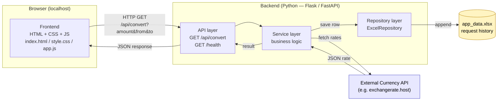
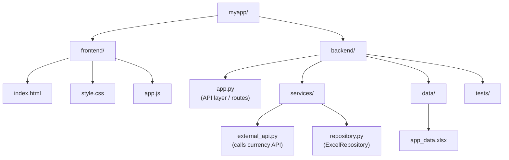
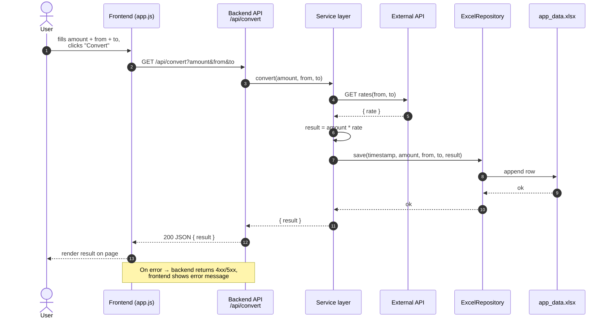
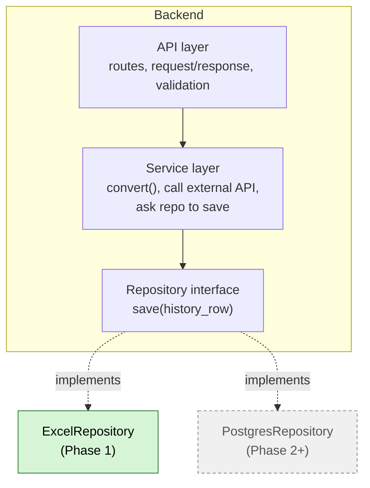
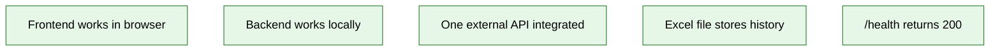

# Phase 1 — Local App (no Docker)

Visual reference for the Phase 1 build: **frontend + backend + Excel as persistence**.
Use these diagrams as the mental model while you implement the app.

---

## 1. High‑level architecture



**Key rule:** the frontend never touches the Excel file. Only the backend does.

---

## 2. Folder structure



---

## 3. Request flow — “Convert” button



---

## 4. Backend layering & the swap point

The whole point of splitting layers in Phase 1 is so that **only the repository changes** later.



Frontend ↔ API contract stays identical when the repo is swapped.

---

## 5. Health check

```mermaid
flowchart LR
    Client["curl / browser / monitor"] -- "GET /health" --> H["Backend /health"]
    H -- "200 OK<br/>{ \"status\": \"ok\" }" --> Client
```

---

## 6. Done criteria checklist



---

## 7. Excel row schema

| column      | example                  |
|-------------|--------------------------|
| timestamp   | 2026-04-30T19:37:12Z     |
| amount      | 100                      |
| from        | USD                      |
| to          | EUR                      |
| result      | 92.34                    |
