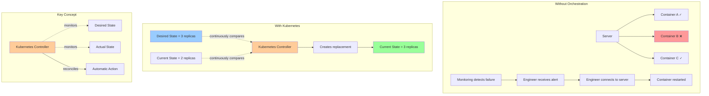

# Kubernetes Orchestration Flow

## Without Orchestration vs With Kubernetes

## Important Concept

**Kubernetes continuously compares desired state with actual state** and automatically takes action to reconcile any differences.

### Without Orchestration:
- **Manual intervention required**
- Downtime until engineer responds
- Human error possible
- Slower recovery time

### With Kubernetes:
- **Automatic self-healing**
- Immediate detection and response
- Consistent and reliable
- Faster recovery time
